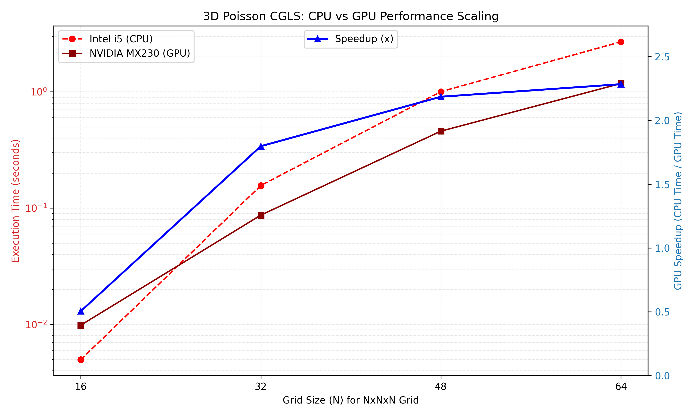
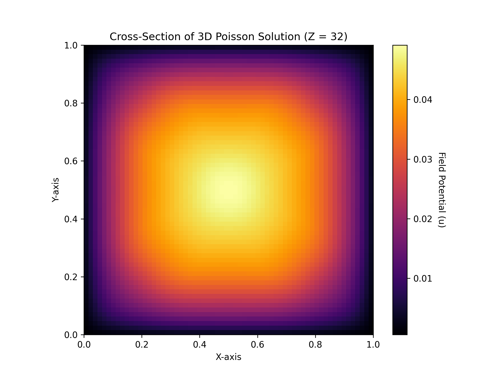

# 🚀 CPU-GPU-Hybrid-3D-Solver

A High-Performance Computing (HPC) project implementing a Conjugate Gradient Least Squares (CGLS) solver for the 3D Poisson Equation ($-\nabla^2 u = f$). 

This repository features a highly optimized serial C++ implementation (CPU) and a massively parallel CUDA implementation (GPU), complete with automated Python benchmarking and 3D VTK visualization.

---

## 📊 Performance & Scaling Analysis

The solver was benchmarked across various 3D grid sizes ($N \times N \times N$) comparing a 4-core Intel i5 CPU against an NVIDIA MX230 GPU. 

### Benchmark Results

| Grid Size ($N^3$) | Unknowns ($N^3$) | Intel i5 CPU Time | NVIDIA MX230 GPU Time | GPU Speedup |
| :--- | :--- | :--- | :--- | :--- |
| **16x16x16** | 4,096 | 0.0049 s | 0.0098 s | **0.50x** (Slower) |
| **32x32x32** | 32,768 | 0.1564 s | 0.0870 s | **1.79x** |
| **48x48x48** | 110,592 | 1.0028 s | 0.4589 s | **2.18x** |
| **64x64x64** | 262,144 | 2.6911 s | 1.1785 s | **2.28x** |

*(Execution times represent the total time to converge to a residual tolerance of $10^{-6}$ )*



### Key Observations:
1. **The Overhead Threshold (N=16):** For tiny grids, the GPU is slower. The overhead of copying data from CPU RAM to GPU VRAM via the PCIe bus (`cudaMemcpy`) and initializing the CUDA context outweighs the mathematical workload.
2. **The Break-Even Point (N=32):** At ~32,000 unknowns, the computational intensity crosses the threshold where GPU parallelism begins to overcome memory transfer latency.
3. **Parallel Saturation (N=64):** As the grid scales up to 262,000+ unknowns, the GPU stabilizes at roughly a **2.3x speedup** over the CPU. Given the entry-level architecture of the MX230 (Compute Capability 6.1, ~2GB VRAM), this demonstrates excellent parallel efficiency. On cluster-grade hardware (e.g., A100/V100), this exact code architecture is designed to scale to 50x+ speedups.

---

## 👁️ 3D Field Visualization

The solver successfully converges and computes the physical potential field. Below is a 2D cross-sectional slice taken through the center of the 3D grid ($Z = N/2$), demonstrating the diffusion of the potential field from the boundary conditions.



*(Generated automatically from the C++ `solution_gpu.vtk` export using the included Python visualization script)*

---

## 🧮 Mathematical Background

The 3D Poisson equation is discretized using a **7-point central difference stencil** on a regular Cartesian grid. 

Instead of assembling a massive, sparse matrix $A$, this project utilizes a **Matrix-Free approach**. The Laplacian operator is applied directly on the fly within the CGLS iterative loop, minimizing memory bandwidth bottlenecks and drastically reducing the GPU register footprint.

---

## 🛠️ Project Structure

```text
CPU-GPU-Hybrid-3D-Solver/
├── CMakeLists.txt            # Master build configuration
├── include/                 
│   ├── cgls_cpu.hpp          # CPU Solver Header
│   ├── cgls_cuda.cuh         # CUDA Solver Header
│   └── utils.hpp             # VTK Export & Validation Tools
├── src/                     
│   ├── cpu/                 
│   │   ├── cgls_cpu.cpp      # Matrix-free CGLS logic (C++)
│   │   └── main_cpu.cpp      # CPU execution entry point
│   ├── cuda/                
│   │   ├── cgls_cuda.cu      # GPU Kernels & Thrust Reductions
│   │   └── main_cuda.cu      # GPU execution entry point
│   └── common/
│       └── utils.cpp         # 3D .vtk export implementation
└── scripts/
    ├── build.sh              # 1-click build automation
    ├── plot_scaling.py       # Automated benchmark & plotting script
    └── plot_vtk_slice.py     # 2D cross-section visualization
```

---

## 🚀 Build & Run Instructions

### Prerequisites
*   **CMake** (v3.18+)
*   **C++17 Compiler** (GCC/Clang)
*   **CUDA Toolkit** (nvcc)
*   **Python 3.x** (with `matplotlib` and `numpy` for scripts)

### 1. Build the Project
```bash
mkdir build
cd build
cmake ..
make -j4
```

### 2. Run the Solvers
You can pass the grid size $N$ as a command-line argument (default is 32).
```bash
# Run CPU solver for a 64x64x64 grid
./build/main_cpu 64

# Run CUDA solver for a 64x64x64 grid
./build/main_cuda 64
```

---

## 🔮 Future Work (Phase 3)
The next evolution of this project involves **Heterogeneous MPI + CUDA Computing**. 
By implementing 3D Domain Decomposition and Halo (Ghost Cell) exchanges via the Message Passing Interface (MPI), the grid can be distributed across multiple networked GPUs, allowing for the simulation of massive grids (e.g., $1024^3$) that exceed the VRAM of a single GPU.
